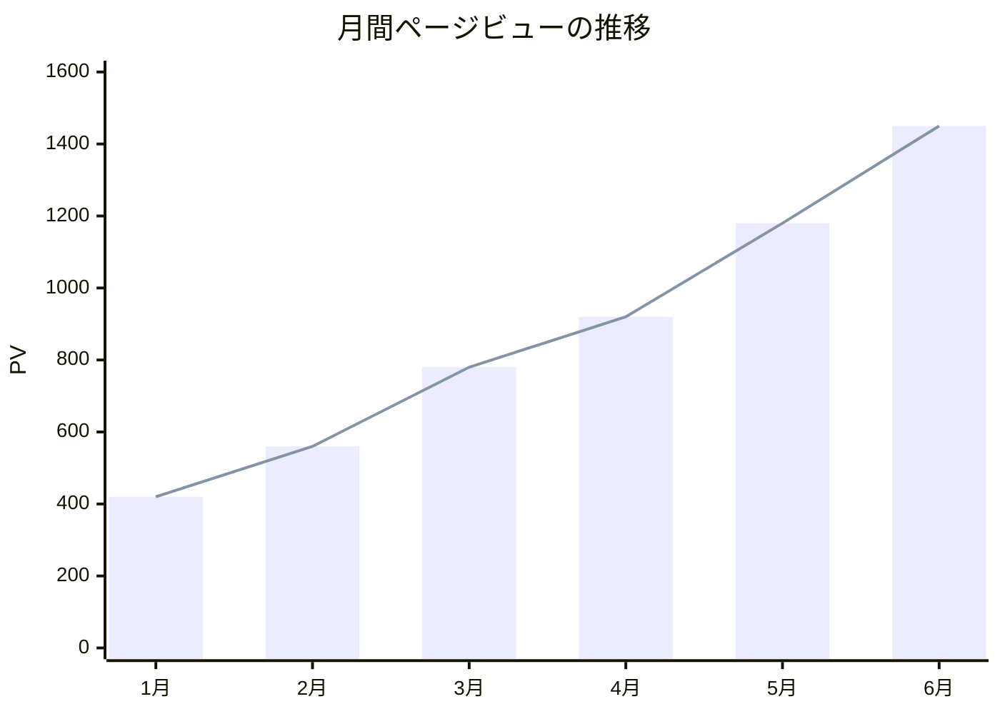
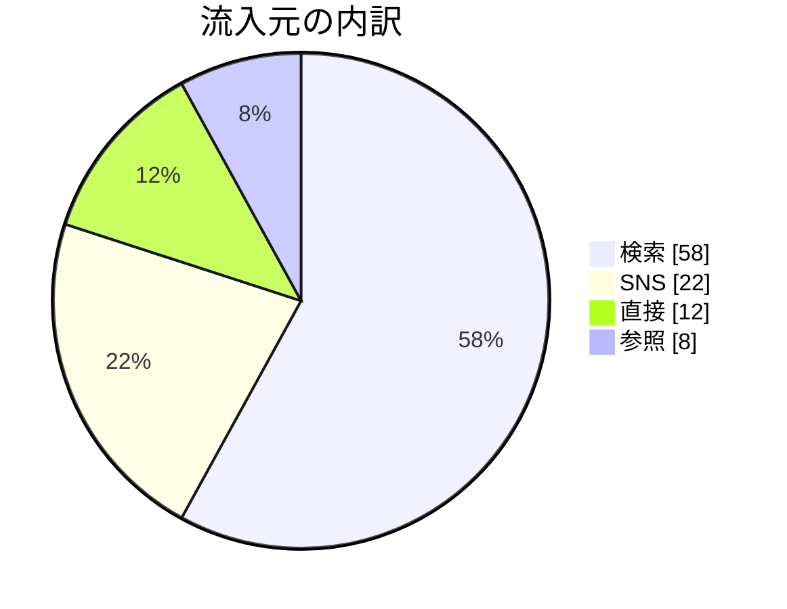
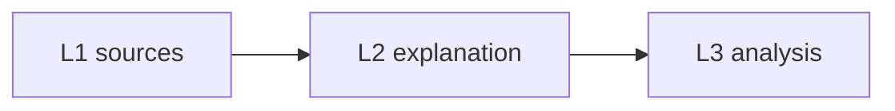

# 記事内の図・グラフ（Mermaid）

記事本文の ```` ```mermaid ```` フェンスは、公開サイト上でインラインの図として描画される。
折線・棒・円グラフと、mermaid の全ダイアグラム（flowchart / sequence など）が使える。

- **書く場所**: Notion の記事本文に「コードブロック」を置き、言語に **Mermaid** を選ぶ。
  `fetch-notion.mjs` がフェンス付き markdown としてエクスポートし、リーダー側の
  `MermaidBlock`（`newsletter/app/src/components/article/MermaidBlock.tsx`）がクライアントで描画する。
- **色は書かない**: パレット・フォント・軸色はサイトのデザイントークン
  （[DESIGN.md](DESIGN.md) の Precision Editorial）でテーマ済み。記事側で色や
  `%%{init}%%` ディレクティブを指定しない。
- **失敗は隠れない**: 構文エラーは `FIGURE FAILED TO RENDER` ブロックとして
  ソース付きで表示される（C-4）。公開前にプレビューで図を必ず確認する。

## 折線・棒グラフ — `xychart-beta`

````markdown

````

- **日本語（非ASCII）のラベルは必ず `"…"` で囲む。** 囲まないと字句解析エラーで描画に失敗する。
- **1チャート = 1系列。** xychart は凡例を描けないため、複数系列を色だけで
  区別することになり判読不能になる。比較したいときはチャートを分けるか表にする。
  同一データの `bar` + `line` 重ね描きは可（棒=ink、線=red で描かれる）。
- **title を必ず書く**（何のグラフかは色ではなくタイトルが伝える）。
- 2軸グラフ（左右で別スケール）は作れないし、作らない。

## 円グラフ — `pie`

````markdown

````

- **`showData` を必ず付ける**（凡例に実数値が出る）。淡色スライスは
  スライス上のラベルが読みにくいことがあり、凡例の数値がその救済になる。
- **スライスは最大5つ。** 6つ目以降は「その他」に畳む。パレットは
  ink → red → グレー3段の固定順で自動割当。

## 図解 — flowchart / sequence など

````markdown

````

mermaid の他のダイアグラムもそのまま使える。ノードは角丸なし・トーン差で
区切られたボックスとして描かれる（No-Line ルール準拠）。

## デザイン上の約束（実装側で担保済み・変えない）

- カテゴリカル色は固定順 `#2d3338 → #c1000a → #757c81 → #acb3b8 → #dde3e9`
  （ink 優先、red は2番目の「外科的」アクセント。隣接ペアの色覚多様性
  ΔE ≥ 17 検証済み。順序のローテーションはしない）。
- 角丸 0px・区切りは線でなく背景トーン・軸とグリッドは控えめなグレー。
- 図は `surface-container-low` のブロックに載り、幅は本文カラムに収まって
  スクロール／縮小する。印刷時はページ境界で分割されない。

このテーマ定義は Zone A（デザイントークンの写像）。パレットは
`newsletter/app/src/config/site.ts` の `FIGURE_TOKENS` / `FIGURE_CATEGORICAL`、
mermaid への写像は `MermaidBlock.tsx` の `themeVariables`。変更は diff 提案として出し、
operator 承認を得る。

## 制約

- ホバー・ツールチップ等のインタラクションは無い（mermaid の限界。
  自前チャートエンジンは作らない — design-policy の外部基盤優先）。
- mermaid バンドル（約1.5MB）は図を含む記事を開いたときだけ遅延ロードされる。
  図のない記事のペイロードは変わらない。
