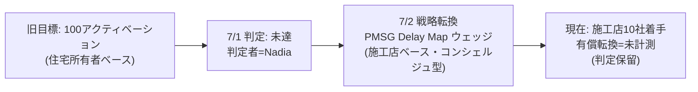
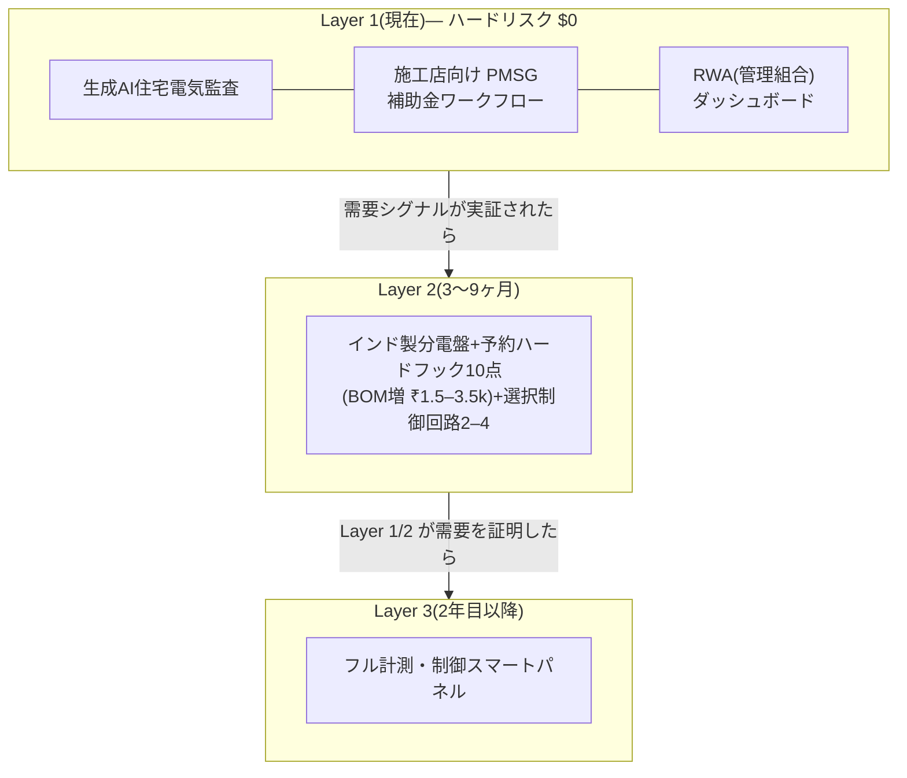
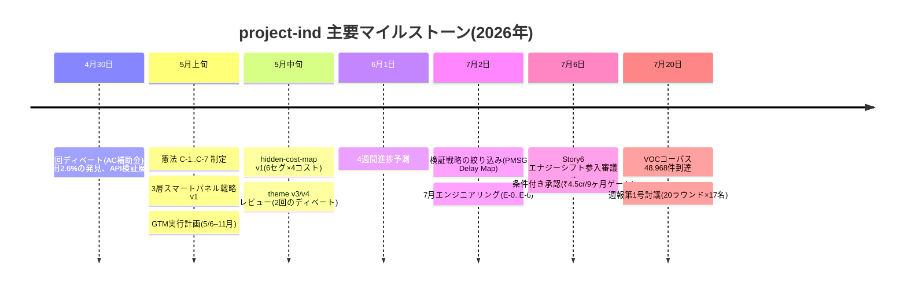
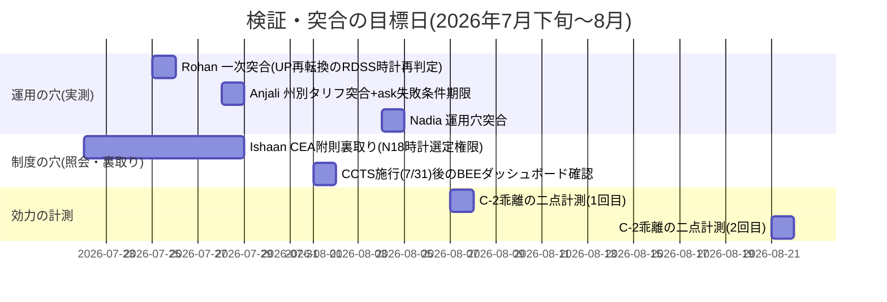

# project-ind 週報 第1号 — 全活動凝縮レポート(2026-07-21)

本レポートは、インド住宅向けスマートパネル事業「project-ind」の初回週報である。初回につき、週次の枠組みを用いながら、プロジェクト開始(2026-04-30)から現在までの約3ヶ月の全活動を凝縮して報告する。作成にあたっては、リサーチ・開発・IR・編集の17名のワークフォースメンバによる20ラウンド(338発言)の合同討議を実施し、その合意事項——「悪い知らせを分母付きで先に」「判定者・判定日・判定基準のない数字は証拠でなく主張」——を本文の書式規律として適用している。

---

## 1. 要旨 — まず未達の報告から

**当初目標「7月1日までに100アクティベーション(住宅所有者ベース)」に対し、実績は施工店10社への深掘り着手・有償転換は未計測である**(判定者=Nadia、判定日=2026-07-01)。目標は住宅所有者単位、実績は施工店単位であり、単位が異なることをここに明記する。この未達を受け、7月2日に検証戦略を「広く100人」から「狭く深い検証ウェッジ」へ転換した(§3)。**この転換は撤退でも失敗でもない**——憲法C-7(正直なシグナル:友人・デモ・シードデータで仮説を承認しない)に従い、実ユーザーで計測できる形に検証を作り直した判断である。ただし「狭い検証への転換」は**需要確認の完了を意味しない**。

技術面の正直な現状も要旨に置く:(1) ADR-0004が定める同期LLMの非同期化トリガ(p99>25秒が2週連続)は**宣言のみで、計測パイプラインが未接続**である。(2) 週報の編集ガード(「支給済み」等の確定調語を機械的にブロックするW-1類似のチェック)は**設計済み・実装はユニットテスト待ち**である。

*凡例:「未計測」「判定保留」は本レポート共通の第3状態語彙(§6)。達成/未達の二値に丸めない。*

---

## 2. プロジェクト概要(初回のための基礎情報)

**事業テーゼ:「AIで需要を発見し、ワークフローで商流を作り、最後にスマートパネルを差し込む」。** ハードウェアを先に作らず、ソフトウェア(施工店向けワークフロー・住宅所有者向け監査)で需要シグナルを捕捉してから、インド製分電盤(Layer 2)、フル計測・制御のスマートパネル(Layer 3)へ段階的に進む3層戦略である。

- **市場文脈:** インドの屋根置き太陽光は政策(PM Surya Ghar、以下PMSG)で急拡大中——登録ベンダーは1年で6,552→40,000超、一方で予算₹75,021 croreの執行は約20%、申請→設置転換は22.7%に留まる。この「制度は立派だが執行が滞る」ギャップ自体が当事業の一次的な機会である。
- **政策依存の設計制約:** PMSG は2029年までに縮小・変質するリスクが合算75%と見積もられており、**PMSG依存度≤50%**を設計ルールとし、RWA共用部と白ラベルOEMの2トラックを初日から並走させている。
- **ガバナンス:** プロジェクト憲法(C-1〜C-7)が最上位規範。特に C-1(出荷>指標>ただし信頼毀損は両方に拒否権)、C-3(全機能に指標+14日窓、動かなければ自動リバート)、C-7(正直なシグナル)が本レポートの書式にも直接効いている。
- **体制:** 米国拠点の創業者1名+AIエージェント・ワークフォース(リサーチデスク、開発、IR、編集)+現地採用(プネBD 2名・CS 1名、7月着任予定)。現地スタッフは**未着任**である。

---

## 3. 3ヶ月の活動実績(タイムライン)

**(a) エビデンス基盤 — VOCコーパス。** Reddit+YouTube→LLM抽出の自動パイプラインが3時間毎に稼働し、**生データ48,968件(ユニーク46,836件)、ペイン所見4,647件、構造的(非明示)ペイン候補915件、日次ダイジェスト74本**(5/8〜7/20)を蓄積した。主要ペインの上位は、施工安全・賠償(強度84–90)、ベンダー詐欺・据付後放置(所見の約11%)、ネットメータリング検針異常、低電圧による家電故障。特に「施工店とDISCOM(配電会社)の間の責任の空白」「竣工したのに初回請求がゼロにならない試運転ギャップ」は、競合が名指ししていない構造的ウェッジである。

**(b) プロダクト。** AWSサーバーレス構成(Node 24 / TypeScript / SAM)で、L1→L3リサーチパイプライン、監査API、そして7月分の「PMSG Delay Map」一式(施工店インテーク、PMSGステージ台帳、SLAコホート出力、施工店向け1枚readout、住宅所有者ステータスチェッカー、月末evidence readout)を実装した。ADRは17本(うち0011–0015はProposed)。PDF生成・ログイン機構は意図的に7月スコープから外している(コンシェルジュ型のため不要)。

**(c) 意思決定の記録。** 多視点ディベートを5回実施(AC補助金/US R&D橋渡し/theme v3/othello-corner/Story6)。直近のStory6審議(7/6)は「エナジーシフト参入」を**条件付き承認**とし、検証ゲートT1–T3と撤退条件(3点中2点未達で撤退、予算₹4.5 crore/9ヶ月/プネ+ベンガルール)を明文化した。

**(d) GTMの現在地。** 7/2の絞り込み後のオファーは無料の「**PMSG Delay Map**」——「滞留5件を送れば、48時間で施工店ロゴ入りの1枚ステータスシート+プネ全域の待ち時間比較を返す」。ICPはプネ/PCMCの小規模施工店(Excel+WhatsApp運用、「補助金いつ出るの?」の電話に追われる層)。PMSGポータルのベンダーリストがリード在庫(50社=初日在庫)であり、現在10社への深掘りに着手している(有償転換は未計測)。

---

## 4. 市場・政策環境の統合認識(リサーチデスクの収束)

インドデスク5名(Anjali/Ishaan/Rohan/Sneha/Sofia)+Jay+Julianの7月の独立調査は、示し合わせなしに3本のスレッドへ収束した。米国デスク(Grace)とクロスマーケット(Amara/Tessa)の比較がこれを裏打ちする。**確度区分:以下では「確認済みの制度的事実」と「他市場からの類推」を明示的に分けて書く。**

**スレッド1 — 「firm化に最初に払うのは決して家庭ではない」(事実)。** SECI・GUVNL・CERCの一連の入札・命令(BESS容量価格₹1.85–2.12 lakh/MW/月、確約ピーク₹6.74/kWh等)は、支払者が常にDISCOM・VGF基金・開発事業者保証であることを示す。Sofiaのベンチマーク(米VPP、豪、独§14a、日METI)でも「家庭のフレキシビリティに最初に払う者は市場が発見するのではなく、政策が指名する」が再現した。**含意:** 当事業の初期収益は家庭のWTPに賭けず、施工店ワークフロー(そして将来のDISCOM B2B)に置くという現行設計は、この事実と整合している。

**スレッド2 — PMSGチャネル再編とEPC運転資金ギャップ(事実+当社仮説)。** ULA(Utility-Led Aggregation)入札(例:ジョードプル₹627.5 crore/10万世帯)は施工店を「チャネル」から「下請け」に変えつつあり、規制上の救済措置はことごとく住宅屋根サイズの上だけに効く(Jay)。一方、**竣工〜補助金入金の間に施工店がハード+労務費を立て替える運転資金ギャップには、どの政策も触れていない**。補助金支給の公式ベンチマーク30営業日に対し実態は6–8週超(Sneha)、UP州では約83 lakhの前払メーターが後払へ再転換され回収前提が崩れた(Rohan、単一州の事例でありトレンドと呼ばない)。**含意:** PMSG Delay Mapはこのギャップの「可視化」から入る正しい位置にいる。ただし§6のN18(下記)がこのウェッジの制度的存続に関わる。

**スレッド3 — スマートメーターのデータ排気(事実)と両義性(当社仮説)。** CEAは7/6、DISCOMにスマートメーターデータでの負荷予測・OMS接続を勧告した。設置4.93 croreに対し前払で実稼働は1.6 croreに留まり、マハラシュトラでは請求ショック(月₹750→約₹1 lakhの報告例)への苦情3.92 lakh件に対し州首相答弁は「正当は210件」——**公式統計が消す声の痕跡を拾うことが当社VOCパイプラインの存在理由である**(Sneha)。同じメーター群がデータ資産(機会)と請求ペイン(反発)の両方を生む点は未解決の作業仮説(N11)として追跡する。

**横断(米国比較・類推):** 米国ではデータセンター負荷を上流ドライバーとしてFERC §206ショーコーズ、州レベルの専用料金クラス等が動くが、Graceの観察「拘束力のある層は連邦の見出しの一段下(州)に着地し続ける」はインドにも写像できる——**当社が読むべき「効力の時計」は中央の公表でなく州・DISCOMの契約と規制庁承認にある**(これは類推であり、インドでの検証は§6のN18/照会askで行う)。またAmaraの豪州先例「計測制度の単一化が遅れるほど運転資金ラグの可視化が遅れる」は類推的先例として採用し、事実とは区別して扱う。

---

## 5. チームの個人活動と相互ラーニング

初回週報につき、討議(B1ブロック)で行った各自の振り返りの要点を記す。

| グループ | メンバ | 3ヶ月(直近1ヶ月中心)の主な個人活動 |
|---|---|---|
| リサーチ統括 | Tessa | 米・EU・印・カーボンの横断政策ウォッチ。CCTS初回履行期限(7/31、約490義務対象)とFERC §206の並行追跡から「公表時計と効力時計の乖離」を統合テーゼ化 |
| インドデスク | Anjali | CEAスマートメーター勧告の製品含意、PMSG予算の過剰資金・執行遅延(FY26改定見積~15%未消化)の特定、州別タリフ突合(7/28完了目標) |
| 〃 | Ishaan | CERC DSM第3次改正・接続/GNA第4次改正等のドケット精読。「announced→notified→operational」の3状態追跡手法を自己批判込みで確立 |
| 〃 | Rohan | 「承認は執行ではない」——World Bank $890M・ULA入札・RDSS・州上乗せの4スキーム比較で遅延の駐車先を特定。製品向け「2つの買い手クラス」フレーム |
| 〃 | Sneha | 請求ショック・消費者裁判所判例・補助金遅延のVOC実証。自身の調査バイアス台帳(生存者/資産保有者/事前セグメント化)を公開 |
| 〃 | Sofia | 「誰が払うか」の国際ベンチマーク(印BESS価格・米VPP・豪・独・日)。「ベンチマークは数字でなくスキーマ」の手法論 |
| 〃 | Jay | EPCチャネル上方集約の検知→反証への転換。**EPC運転資金ギャップ**を耐久プロダクトテーゼとして提起 |
| ファイナンス | Julian | 家庭層ファーストロスの不在を証明→「補助金として計上されている」へテーゼ反転。証券化レバー(RBI PSL改正)の特定、タームシート起草へ |
| 米国デスク | Grace | FERC/NERC/州PUCの高密度ウォッチ(2日で26件)。「拘束層は一段下」の発見、§205先例による確定調語リスクの特定 |
| クロス市場 | Amara | 「インドに欠けるのは電線でなく価格シグナル」→3層スタックへ精緻化。自らのkill基準に2度抵触させるストレステスト運用 |
| 開発 | Dario | CI/サプライチェーンセキュリティ動向の接地、ガバナンス自動化の false-state 4件の検出——「組織を監査するツールが最も監査されていない」 |
| 〃 | Ren | ランタイム廃止時計の誤警報排除(Lambda nodejs24.x確認)、PRレビューでの切り詰め出力リスク検出、「リリースノートを自リポジトリに接地する」査読手法 |
| 〃 | Farah | 計測妥当性(SLOクエリの過少集計修正、retryでの合格=サイレント劣化)。「4週で12 SLI提案・0バインド」の原因を継ぎ目の欠落と特定 |
| PM | Nadia | India Energy Stack・DPDP・Account Aggregator等の参入制度マップ。pr-autopilot運用の空振り分析(7回中6回) |
| IR | Corinne | SEC規則ウォッチとファウンダーレター規範。**「ローライトを先に、分母を添えて」** |
| 〃 | Marisol | ILPA v2.0/ESRS改訂の突合。「数字を1つも照合していない報告席はまだコメンタリー」という正直なゼロ報告 |
| 編集 | Elena | 記事生成パイプラインの「正しいが覆い隠すスキップ」検出、有償提携由来数字のロンダリング防止(ソースレベル・スコアリング提案) |

**相互ラーニングの実例(討議B1で確認):** RohanのUP前払メーター再転換はSofiaのWTP分析の前提(回収メカニズム)を直撃し、SofiaはこれをN=1として扱う規律をRohanに要求した。JayのEPC運転資金ギャップはJulianのファーストロス分析と結合し「誰がこのギャップをファイナンスするか」という新仮説(N19:施工店同士のインフォーマル融通)を生んだ。FarahのSLI「0バインド」の教訓は、RenがADR-0004のトリガ未計測(N9)を発見する直接の契機になった。IshaanのRDSS=中央MoP直轄/AMISP=州DISCOM契約という監督官庁分離の発見は、NadiaのIndia Energy Stack参入テーゼに対する最大の反証候補(N18)として登録された。

---

## 6. 仮説ボードと検証状況

討議B4で、事業の公式検証ゲートと、活動から生まれた作業仮説を一枚のボードに統合した。**状態語彙は5値:検証済/一部検証/反証/進行中/未着手**。「検証成功」「需要確認」等の確定調語は本レポートでは禁止語である。

### 6.1 公式検証ゲート(事業判断に直結)

| ゲート | 内容 | 状態 | 現在の根拠と次アクション |
|---|---|---|---|
| H1(2ヶ月計画) | 監査MVPを4週で構築可能 | 検証済 | E-0..E-6一式がmainに実装済み。ただし実AWS本番稼働の対外証跡は未整備 |
| H2 | EPCが₹500–700/jobを払う | 未着手→設計変更 | 単体SaaSでは自走不可の試算により、検証単位を「無料Delay Map→有償転換」に再設計(7/2) |
| H3 | 補助金却下率30%減 | 未着手 | T3(下記)に統合。処置/対照設計は定義済み、母集団獲得前 |
| T1(Story6) | 施工店60接触→標準見積掲載≥20+有償継続≥40% | 進行中(分母未達) | 接触10社着手。判定者・判定日・判定基準の3点セットが揃うまで進捗率は本文非掲載 |
| T2(Story6) | villa WTP≥₹8,000がN=50の≥30% | 未着手(分母未着手) | N=0。現地CS着任後の対面接触が前提(ask 1) |
| T3(Story6) | 処置30 vs 対照90で支給中央値≥30日短縮 | 未着手 | 二重時計問題(N18)の解決が測定設計の前提 |
| B2(CEOベット) | ゼロ価格でも需要が引ける | 進行中 | Delay Map 48時間返却の初回コホートで計測開始予定 |
| B7 | リサーチ出力がモートになる | 一部検証 | コーパス4.9万件・所見4,647件は蓄積済み。外部参照(DR≥50ドメイン≥8)は未計測 |

### 6.2 活動から確立した作業仮説(選抜。全21件は討議記録参照)

| # | 仮説 | 状態 | 一言根拠 |
|---|---|---|---|
| N1 | 全スキームは2買い手クラス((a)DISCOM側収益保証アナリティクス/(b)施工店・EPCツーリング)に収斂する | 一部検証 | 4スキーム比較で再現(Rohan)。当面(b)に集中、(a)は将来のDISCOM B2B |
| N2 | 承認は執行ではない(紙上の承認と現場執行のギャップが全スキームで再現) | 検証済 | World Bank承認済$890M vs 未執行、PMSG執行~20%等 |
| N4 | 竣工〜補助金入金のEPC運転資金ギャップは製品化可能なウェッジ | 一部検証 | 政策の空白を確認(Jay)。反例n=1(グジャラート)は脚注扱い、来週n=5へ |
| N5 | payerは政策が指名する(市場は発見しない) | 一部検証 | 印・米・日・豪・独で再現(Sofia) |
| N6 | ファーストロスは欠落でなく「補助金」として計上されている | 進行中 | 家庭層デリスクの構造分析(Julian)。タームシート起草が次段 |
| N9 | ADR-0004のp99トリガは宣言のみで計測未接続 | 検証済 | 発見済み・修正PRを来週先行(Ren)。**技術ローライトとして§1に掲載** |
| N11 | 同一メーター群でデータ資産と請求ペインが逆方向に効く | 進行中 | CEA勧告 vs 苦情3.92 lakhの併存(Anjali/Sneha) |
| N18 | 「支給済み」の定義は時計選定(RDSS=中央MoP vs AMISP=州契約)で変わり、EPC運転資金ラグが制度上「存在しない」ものとして固定されうる | 進行中 | 監督官庁分離は確認済み事実(Ishaan)。単一時計選定の制度的根拠は未確認——CEA附則裏取りまで中立表現 |
| N19 | EPCは運転資金ギャップを施工店間のインフォーマル融通で埋めている | 進行中 | Jay新仮説。現地ヒアリング(CS着任後)で検証 |

**このボードの読み方(経営層向け):** 「検証済」が2件しかないのは規律の証拠であって停滞の証拠ではない。逆に、T1/T2の分母(施工店60接触・villa N=50)が**現地スタッフ着任なしには物理的に埋まらない**ことが、今週のasks(§8)の根拠である。

---

## 7. リスク(5点)

1. **データソース脆弱性。** VOCパイプラインのReddit側が403遮断(115クエリ)され、直近流入は100% YouTube由来に偏っている。加えて収集は単一マシンのcronに依存(GH Actions版はReddit OAuth承認待ち)。*類推的注記(採否は最終校正判断):計測が単一化されていない期間は短期指標が見かけ上良く出る逆説(N21)がこの偏りにも当てはまりうる。*
2. **実行リスク。** 米国リモート創業者1名+未着任の現地スタッフという体制で、T1の「60接触」は現状の接触経路(LinkedIn起点コールド)だけでは分母形成が遅い。AI+フリーランス混成ワークフォースの実運用も未検証である。
3. **マイルストーン遅延。** §1のとおり旧目標100は未達(実績=施工店10社着手・有償未計測)。アクティベーション時計はリセットされた。州別クロス集計は分母未確定のため未掲載(Anjaliの突合、7/28完了目標)。
4. **政策依存。** PMSG縮小リスク合算75%に対し依存度≤50%ルール+RWA/OEM並走で緩和中。**追加の制度リスクとして、支給計測の監督官庁が分離している(RDSS=中央MoP直轄/AMISP=州DISCOM契約+州規制庁承認)ことを確認した。** IES(India Energy Stack)がどちらの時計を採るかは制度的に確定していない(§8 ask 3)。
5. **ドキュメント・計測のドリフト。** リポジトリ内の一部運用文書がmainの実態と乖離(修正PR予定)。技術ガードの実装状態は二重表記で開示する:W-1類似の確定調語ブロック=設計済み・**ユニットテスト未通過**、EXEC台帳との結合キー設計=**未着手**、ADR-0004計測SLI定義PR=**未マージ**。

---

## 8. 経営層・スポンサーへの依頼事項(asks)

各askには判定基準・失敗条件・期限を付す。判定者・判定日が未確定の数字はaskの根拠に使わない。

| # | 依頼 | 判定基準 | 失敗条件・期限 |
|---|---|---|---|
| 1 | **プネBD 2名・CS 1名の7月着任の確定**(または遅延の確定通知) | 着任日が確定し、T2の対面接触経路(villa N=50)とVOC現地接続の開始日が置けること | 7/28までに未確定なら、T1/T2の9ヶ月ゲートの起点日を後ろ倒しする再計画をDario/Elena宛にエスカレーション |
| 2 | **BEE(CCTS)コンプライアンス・ダッシュボードの稼働確認の権限付与** | 7/31施行日翌日に「稼働有無」の一行報告ができること(分子未取得・取得経路=BEE公開ダッシュボード・稼働予定日未定、の現状書式から前進) | 8/1時点で経路不在なら「経路不在(期限付き)」として翌週報に繰越 |
| 3 | **IES時計選定の制度的所在の照会承認** — 宛先はMoP(RDSS所管)と州DISCOM/州規制庁(AMISP契約当事者)の**双方に分離**して送付 | 照会送付日と回答期限が確定すること(回答目標日未定なら「凍結」タグ。一次回答目標30日以内を目安、豪州類似照会の6–8週実績を参考値とする) | 7/28までに送付未承認なら、N18は「検証手段なし」として仮説ボード上の状態を降格 |

---

## 9. 次週の検証カレンダー

*運用の穴・制度設計の穴・時計選定の穴は根拠が異なるため、同一の日付・集計・図に混ぜない(討議B5合意)。*

---

## 付記 — 本レポートの作成プロセスと限界

本レポートは agent workforce の17名(リサーチ9、ファイナンス1、開発・PM 4、IR 2、編集1)による**20ラウンド・338発言の合同討議**(2026-07-21実施、全文記録はproject-indリポジトリ `debates/sessions/` に保存)を経て、編集(Elena)の構成案に沿って作成された。討議はメンバ各自の実活動フィード(workforce実データ)とリポジトリの一次文書に接地している。限界を明記する:(1) 参加ペルソナはLLMであり、現地実査・当事者ヒアリングは含まれない。(2) 引用数値の一部(政策・市場データ)は各メンバの調査時点のものであり、一次資料での再確認前の値を含む。(3) 本文の「事実」と「類推」の区分は討議での合意に基づくが、確度の最終責任はオペレータの校閲に委ねる。次号(7/28週)から通常の週次フォーマット(前週比+検証カレンダー消化状況)に移行する。
