# Agent Workforce 全体像 — 業務ワークフロー概念図

> 経営者にそのまま伝わる言葉に統一した概念図。個人名は役職名に、内部の制度番号（憲法/法律/規制/執行ルールの階層名など）や社内スキル名の直書きは、意味の通じる日本語表現に置き換えている。編集品質レビューは監査ではなく記事化レーンの一部として整理し、リサーチ活動はVP機能別に再編、Podcastレーンには素材の入口と配信の出口を明示した。

## 図：組織構造と業務ワークフローレーン

```mermaid
flowchart TD
  operator["🧑‍💼 経営者(人間・唯一の最終意思決定者)<br/>方針決定 / 予算承認 / 最終判断"]

  subgraph LEAD["🎯 方向づけ"]
    direction LR
    maya["代表"]
    camille["経営企画統括"]
    nadia["プロダクト責任者"]
  end

  subgraph GOV["🏛️ ガバナンス層(全レーンを横断して統治)"]
    direction LR
    const1["憲法<br/>(変更不可の大原則)"]
    const2["法律<br/>(分野ごとの統治文書。改定は審議のうえ蓄積し、上書きはしない)"]
    const3["規制<br/>(自動でチェックされる仕組み)"]
    const4["執行ルール<br/>(判断に迷った時に従う手順)"]
    ratchet["再発防止サイクル<br/>(同じ失敗が90日以内に2回起きたら自動的に規制へ格上げ)"]
    const1 --> const2 --> const3 --> const4
  end

  subgraph HIRING["🧑‍💼 採用ラウンド(非定期・数週間毎)"]
    direction LR
    p_hire["人事・法務担当VP、または課題に気づいた担当VP"]
    hi1["組織課題の分析・他組織との比較"]
    hi2["採用候補の評価＋財務担当VPによるコスト査定"]
    hi3["正式採用手続きへ<br/>(最終決定は経営者)"]
    p_hire --> hi1 --> hi2 --> hi3
  end

  subgraph DEBATE["🗣️ 討議・合議(非定期・経営者招集)"]
    direction LR
    p_deb["代表(議長)＋関係VP・専門メンバー"]
    d1["ガバナンス改定案の審議委員会<br/>(承認/却下を答申)"]
    d2["部門横断ブレインストーム<br/>(論点ごとに関係者を招集して議論)"]
    p_deb --> d1
    p_deb --> d2
  end

  subgraph SDLC["💻 ソフトウェア開発"]
    direction LR
    p_eng["エンジニアリング担当VP 傘下チーム(開発・品質保証・検証)"]
    sd1["開発タスクの要件整理"]
    sd2["課題の実装対応"]
    sd3["コードレビュー・承認プロセス"]
    sd4["テスト網羅性の点検"]
    p_eng --> sd1 --> sd2 --> sd3 --> sd4
  end

  subgraph AUDIT["🔍 監査・検証機能"]
    direction LR
    p_aud["独立監査担当 / 運用信頼性担当VP / 各部門"]
    a1["あえて弱点を探す検証(敵対的レビュー)"]
    a4["計画と実績の照合"]
    a5["自動化の異常検知・責任者への自動割り当て"]
    p_aud --> a1
    p_aud --> a4
    p_aud --> a5
  end

  subgraph RESEARCH["🔬 日々のリサーチ・キャッチアップ(VP機能別)"]
    direction TB
    res1_lead["リサーチ統括VP 傘下"]
    res1["全社横断の日々の情報収集・重複チェック"]
    res2_lead["政策・渉外担当VP 傘下"]
    res2["エネルギー・グリッド政策の規制動向キャッチアップ(米国・インド)"]
    res3_lead["プラットフォーム担当VP 傘下"]
    res3["エージェント技術・業界動向のリサーチ(他社事例のキャッチアップ)"]
    res1_lead --> res1
    res2_lead --> res2
    res3_lead --> res3
  end

  subgraph SNS["📣 SNS / コミュニティでの切磋琢磨"]
    direction LR
    p_sns["コミュニティ育成担当 / 成長・読者分析担当"]
    s1["読者エンゲージメントの実験サイクル"]
    s2["読者反応の分析"]
    s3["チャット通知(稼働確認・進捗ダイジェスト)"]
    p_sns --> s1
    p_sns --> s2
    p_sns --> s3
  end

  subgraph ARTICLE["📰 共同発見のWeb記事化・メディア対応"]
    direction LR
    p_art["顧客体験担当VP 傘下の編集チーム(各リサーチ担当＋編集長)"]
    p1["一次情報の解説記事化"]
    p2["複数記事の統合分析"]
    p3["記事の正式公開<br/>(誠実性チェック通過後)"]
    ed1["編集品質レビュー・改善提案<br/>(週次、掲載済み記事の点検)"]
    p_art --> p1 --> p2 --> p3
    p3 -. 掲載後レビュー .-> ed1
  end

  subgraph POD["🎙️ Podcast・メディアコミュニケーション"]
    direction LR
    p_pod["渉外・広報担当VP 傘下のPodcastチーム"]
    pd1["Podcast台本化"]
    pd2["音声制作・権利/コンプライアンス確認"]
    pd3["配信判断"]
    p_pod --> pd1 --> pd2 --> pd3
  end

  subgraph REPORT["📊 月次 / 週次レポーティング"]
    direction LR
    p_rep["代表・各VP・組織パフォーマンス担当・財務/対外報告担当チーム"]
    rp1["月次の組織レター"]
    rp2["週次の組織・プロジェクト状況報告"]
    rp3["スポンサー・投資家向け報告ドラフト<br/>(発信は経営者のみ)"]
    p_rep --> rp1
    p_rep --> rp2
    p_rep --> rp3
  end

  subgraph HYGIENE["🧹 組織衛生・基盤運用"]
    direction LR
    p_hyg["基盤・プラットフォーム担当VP 傘下チーム"]
    h1["各メンバーの知見・記憶の整理"]
    h2["組織全体の記憶の矛盾・陳腐化チェック"]
    h3["業務手順の成熟度点検・改善提案"]
    p_hyg --> h1
    p_hyg --> h2
    p_hyg --> h3
  end

  subgraph OUT["🌐 公開・可視化面"]
    direction LR
    site["kohuehara.xyz<br/>(公開記事)"]
    console["社内管理ダッシュボード<br/>(組織図 / 活動記録 / レポート)"]
    gh["GitHub<br/>(コード変更・課題管理)"]
    discord["Discord"]
    slack["Slack"]
    spotify["Spotify / RSS<br/>(音声配信)"]
  end

  operator --> maya
  maya --- camille
  maya --- nadia
  operator -->|"最終承認"| const1

  const2 -. 改定案の審議対象 .-> d1
  d1 -. 承認 / 却下の答申 .-> operator
  d2 -. 統合所見 .-> operator
  hi3 -. 手続き待ちの提案 .-> operator

  sd4 --> gh
  a4 --> gh
  a5 --> gh
  a5 -. 集約通知(1件/回) .-> discord
  a5 -. 集約通知(1件/回) .-> slack
  a1 -. 発見した弱点 .-> ratchet
  ed1 -. 発見した弱点 .-> ratchet
  ratchet -. 規制に格上げ .-> const3

  res1 -. 題材として .-> p1
  res2 -. 題材として .-> p1
  res3 -. 題材として .-> p1
  s2 -. 読者の反応として .-> p1
  p3 --> site
  p3 -. 題材として .-> pd1
  s3 --> discord
  s3 --> slack
  pd3 --> spotify
  rp1 --> console
  rp2 --> console
  rp3 -. ドラフト .-> operator
  site --> console

  classDef lead fill:#1B2A4A,stroke:#0E1830,color:#fff;
  class maya,camille,nadia,operator lead

  classDef gov fill:#2C5F5D,stroke:#0F3634,color:#fff;
  class const1,const2,const3,const4,ratchet gov

  classDef hiring fill:#8C4B5A,stroke:#5E323C,color:#fff;
  class p_hire,hi1,hi2,hi3 hiring

  classDef debate fill:#454B8C,stroke:#2E325E,color:#fff;
  class p_deb,d1,d2 debate

  classDef eng fill:#3E6B9C,stroke:#274563,color:#fff;
  class p_eng,sd1,sd2,sd3,sd4 eng

  classDef audit fill:#9C5A22,stroke:#6B3D14,color:#fff;
  class p_aud,a1,a4,a5 audit

  classDef research fill:#4E8577,stroke:#345850,color:#fff;
  class res1_lead,res1,res2_lead,res2,res3_lead,res3 research

  classDef social fill:#8A5A8E,stroke:#5E3D61,color:#fff;
  class p_sns,s1,s2,s3 social

  classDef content fill:#5E8C3E,stroke:#3F5F2A,color:#fff;
  class p_art,p1,p2,p3,ed1,p_pod,pd1,pd2,pd3 content

  classDef report fill:#B8912E,stroke:#7C611E,color:#fff;
  class p_rep,rp1,rp2,rp3 report

  classDef hygiene fill:#607A6E,stroke:#405249,color:#fff;
  class p_hyg,h1,h2,h3 hygiene

  classDef output fill:#EDEDED,stroke:#999999,color:#111111;
  class site,console,gh,discord,slack,spotify output
```

## 読み方(2つの層)

1. **統治層**(経営者 / 代表 / ガバナンス) — 人間が握るのは「ルールそのもの」と最終承認。エージェントはそのルールの下で実行する。
2. **10の業務ワークフローレーン** — 職能ごとに独立して回るが、出力面(サイト・GitHub・Discord・Slack・Spotify・社内ダッシュボード)と、ガバナンスへのフィードバック(監査や編集レビューの発見→再発防止サイクル→新しい規制、リサーチ/読者反応→次の題材選定)で相互に接続している。うち「採用ラウンド」と「討議・合議」の2つは**定期的なケイデンスではなく、非定期だが頻度の高い**業務で、経営者や代表が必要に応じて招集する。

## 各レーンの詳細(図の省略分を補う一覧)

### 🧑‍💼 採用ラウンド(非定期・数週間毎)
- **担当**：ギャップに気づいた担当VP(人事・法務担当が中心だが、直近の運用信頼性担当VP新設のように他分野のベンチマークレビューが起点になることもある)
- **流れ**：①組織課題の分析・他組織との比較 → ②「今のプロジェクトへの貢献度」「見送っている機会の大きさ」「組織づくりとしての意義」の3軸で候補を評価 → ③財務担当VPがあらかじめ決められた人件費上限の範囲内かを査定(現在の合計上限は月額500ドル相当) → ④採用提案を起票し、経営者が最終承認して正式採用
- **実例**：直近では9名を一括採用した組織ベンチマークラウンドや、運用信頼性担当VPの新設ラウンドがあった
- **出力**：新メンバーが該当する業務レーンに合流する

### 🗣️ 討議・合議(非定期・経営者招集)
- **担当**：ガバナンス改定審議委員会は代表が議長を務め、VPクラス以上(＋議題に応じた専門メンバー)で構成。招集は定期スケジュールではなく、**経営者が対象の変更案と審議事項を都度指定**して起動する
- **流れ**：統治文書への改定案が出た際、委員会が承認/却下を審議し、コメント形式で見解を1件提示する(委員会自体に決定権はなく、最終判断は経営者が行う)
- **もう一つの型**：戦略論点ごとに経営者が関係メンバーを個別に招集し、多角的な視点で討議してから統合するブレインストーム形式(例：新しい取引先への説明資料づくりで、対外報告・競合分析・広報・財務の各担当を順に招集して意見を集めたような進め方)
- **出力**：委員会の場合は審議結果と経営者への判断材料。ブレインストーム形式の場合は統合所見を経営者へ

### 💻 ソフトウェア開発
- **担当**：エンジニアリング担当VP 傘下の開発・品質保証・検証チーム
- **流れ**：開発タスクの要件整理 → 課題の実装対応 → コードレビュー・承認プロセス(複数の担当者の合意が必要) → テスト網羅性の点検
- **出力**：GitHub。変更は必ずレビューを経て反映(直接の書き換えは禁止)

### 🔍 監査・検証機能
- **担当**：独立監査担当(あえてどの部門系列にも属さない)、運用信頼性担当VP(新設)、各部門(計画照合)
- **業務**：あえて弱点を探す検証(週次の敵対的レビュー)、計画と実績の照合、自動化の異常検知(日次。処理が失敗していないか・記録が古くなっていないかを検知し、必ず名前のある責任者に割り当てる。通知は1回の実施につき1件に集約)
- **出力**：発見した弱点はガバナンスの再発防止サイクルへ。異常検知は課題管理システムへの記録＋Discord/Slackへの集約通知

### 🔬 日々のリサーチ・キャッチアップ(VP機能別)
社内で「日々の情報収集」と一括りにせず、担当領域ごとに独立して回っている。
- **リサーチ統括VP 傘下**：全社横断の日々の情報収集・重複や引用の質チェック
- **政策・渉外担当VP 傘下**：エネルギー・グリッド政策の規制動向キャッチアップ(米国・インドそれぞれ専任)
- **プラットフォーム担当VP 傘下**：エージェント技術・業界動向のリサーチ(他社の取り組み事例のキャッチアップ)
- **出力**：いずれも記事化レーンの題材として流入

### 📣 SNS / コミュニティでの切磋琢磨
- **担当**：コミュニティ育成担当、成長・読者分析担当
- **業務**：読者エンゲージメントの実験サイクル(週次)、読者反応の分析(週次)、チャット上での稼働確認・進捗ダイジェスト
- **出力**：Discord / Slack(通知先は設定で選択)。読者反応は次の記事の題材選定へフィードバック

### 📰 共同発見のWeb記事化・メディア対応
- **担当**：顧客体験担当VP(編集全体の一貫性を統括)＋各リサーチ担当(執筆側)、編集長(品質監督)
- **流れ**：一次情報の解説記事化 → 複数記事の統合分析 → 誠実性チェック(空欄や尻切れ原稿を機械的に弾く)を通過したものを正式公開
- **編集品質レビュー**：公開済みの記事群を週次で点検し、最も優れた記事・改善が必要な記事を特定して編集方針を提案する機能もこのレーン内にある。ここで見つかった繰り返しの弱点はガバナンスの再発防止サイクルにも連携する
- **出力**：kohuehara.xyzで公開。ここがPodcastレーンの題材の出所でもある

### 🎙️ Podcast・メディアコミュニケーション
- **入口**：Web記事化レーンで正式公開された記事が題材として流れ込む
- **担当**：渉外・広報担当VP 傘下のPodcastチーム(台本担当／音声制作担当／権利・コンプライアンス確認担当)
- **流れ**：記事をもとにPodcast台本化 → 音声制作と同時に権利・コンプライアンス確認 → 配信判断
- **出口**：Spotify / RSSで配信

### 📊 月次 / 週次レポーティング
- **担当**：代表(全社向け月次レター)、各VP(部門視点の月次レター)、組織パフォーマンス担当(週次の組織状況報告)、プロジェクトごとの責任者(週次の進捗報告)、財務担当VP傘下の対外報告チーム(スポンサー・投資家向けドラフト)
- **出力**：社内管理ダッシュボードのレポート欄、または経営者宛のドラフト(対外報告資料は**経営者のみが発信**、各担当は起案・保留までが権限)

### 🧹 組織衛生・基盤運用
- **担当**：基盤・プラットフォーム担当VP 傘下チーム
- **業務**：各メンバーの知見・記憶の整理(週次)、組織全体の記憶の矛盾・陳腐化チェック(週次)、業務手順(各レーンが使っている型)そのものの成熟度点検・改善提案(週次)
- **出力**：この層が全レーンの「土台」を維持している

### (補足)財務・対外報告 / 法務
上記のレポーティングと監査レーンに重なる形で、財務担当VP傘下の投資家対応チーム(報告書起案担当／訪問対応担当)がスポンサー・投資家向け資料の起草を担当。開示可否の判断は人事・法務担当VP傘下の顧問弁護士役にエスカレーションされる。いずれも**実際の発信は経営者のみ**という一貫した原則が敷かれている。

## ガバナンス(全レーンに効いている前提)

- **憲法**：変更不可の大原則(正式なデータの置き場所は一つに統一する／誠実性を欠く公開はしない／単一の運営規模を保つ／異常は必ず表面化させ、握り潰さない)。改定できるのは経営者のみ
- **法律**：分野ごとの統治文書。改定は審議のうえ蓄積されていき、過去の決定を上書きすることはない。改定案は「討議・合議」レーンの審議委員会にかけられる
- **規制**：自動でチェックされる仕組み(誠実性チェック、公開前の品質ゲートなど)
- **執行ルール**：判断に迷った時に従う手順書
- **再発防止サイクル**：同じ失敗が90日以内に2回起きると自動的に規制へ格上げされる。一度きりで実害の小さい問題は無理に自動化せず、記録だけ残す

---
*本図は2026年7月時点の体制を反映した概念図。細部は簡略化しており、正確な業務フローというより「誰が・何を・どこへ」の地図として参照してほしい。*
